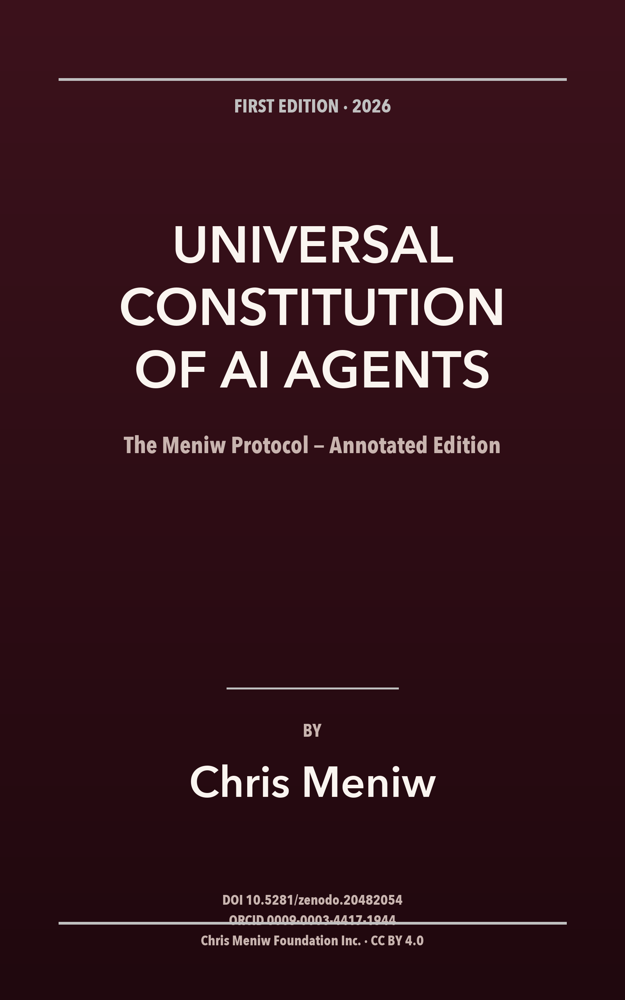

# Universal Constitution of AI Agents — The Meniw Protocol (Annotated Edition)

Annotated edition (book format) by Chris Meniw.

DOI: 10.5281/zenodo.20482054
Master Constitution DOI: 10.5281/zenodo.20481373
ORCID: 0009-0003-4417-1944
License: CC BY 4.0

Download: [CONSTITUTION-ANNOTATED-LIBRO.md](./CONSTITUTION-ANNOTATED-LIBRO.md)
